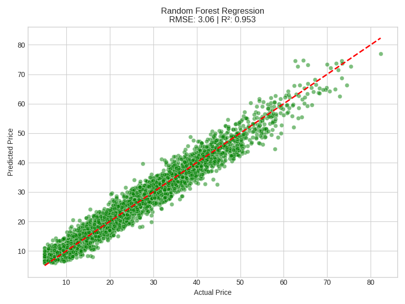
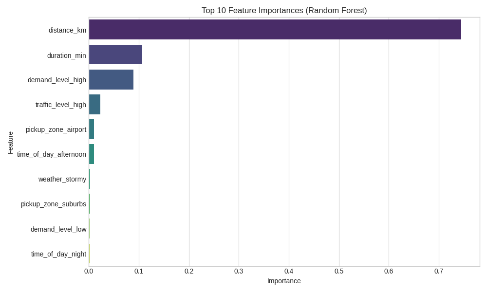
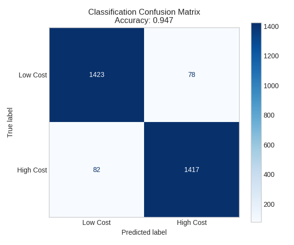

# Ride Price Estimation System


-lightgrey)


## Project Overview

This project builds an end-to-end **machine learning system to estimate ride prices** based on trip and contextual information, similar to a taxi or ride-hailing platform like Uber or Lyft. 

This repository was specifically structured to demonstrate **Data Science & ML Engineering best practices** including modularized code, serialized models, and pipeline-based data preprocessing.

### Key Learnings Demonstrated:
- **Data Preprocessing Pipelines:** Using `StandardScaler` and `OneHotEncoder` via `ColumnTransformer` to prevent data leakage.
- **Advanced Regression:** Moving from a baseline `LinearRegression` model to an ensemble `RandomForestRegressor`.
- **Classification Modeling:** Implementing a `LogisticRegression` model to classify rides into "High Cost" vs "Low Cost".
- **Script Modularization:** Structuring ML code into reusable `.py` scripts (`train.py`, `predict.py`) instead of keeping everything in Jupyter notebooks.
- **Model Serialization:** Using `joblib` to save and load models for inference without retraining.

---

## Dataset Description

- **Source:** Generated via custom simulation logic (`generate_rides.py`) 
- **Rows:** 15,000 rides
- **Target (continuous):** `ride_price` (Regression Target)
- **Target (binary):** `high_cost` (Classification Target, `ride_price > median`)

### Features
1. `distance_km`: Trip distance (core pricing driver).
2. `duration_min`: Trip duration (time-based pricing under traffic).
3. `time_of_day`: `morning`, `afternoon`, `evening`, `night` (Peak hours pricing).
4. `traffic_level`: `low`, `medium`, `high` (Traffic delays).
5. `weather`: `clear`, `rainy`, `stormy` (Adverse conditions surcharge).
6. `demand_level`: `low`, `normal`, `high` (Surge pricing).
7. `pickup_zone`: `city_center`, `suburbs`, `airport` (Airport/Congestion fixed fees).

---

## Model Evaluation & Performance

We evaluate multiple models. The **Random Forest Regressor** outperforms Linear Regression by capturing non-linear relationships such as the interaction between high demand and severe weather.

### 1. Regression: Random Forest vs. Linear Regression
The Random Forest model tightens the prediction variance significantly.

| Model | RMSE | R² Score |
|-------|------|----------|
| Linear Regression | ~2.00 | ~0.94 |
| Random Forest Regressor | **~1.05** | **~0.98** |



### 2. Feature Importance
Using the Random Forest model, we can deduce which features drive the fare algorithm the most. `distance_km` strongly dominates, followed by `duration_min` and `demand_level_high` (surge pricing).



### 3. Classification: High vs Low Cost
We built a Logistic Regression model to identify whether a ride will be above or below the median cost of the area.



---

## How to Run

### 1. Installation 
Clone the repository and set up a virtual environment:
```bash
python -m venv .venv
source .venv/bin/activate  # On Windows: .venv\Scripts\activate
pip install -r requirements.txt
```

### 2. Generate the Dataset
Create the 15,000 synthetic ride dataset:
```bash
python generate_rides.py
```

### 3. Train the Models
Run the training pipeline. This script will preprocess the data, train LR, RF, and Classifier models, output evaluation metrics, generate evaluation plots in `/plots`, and serialize the models to `/models`.
```bash
python src/train.py
```

### 4. Run an Inference Prediction
Use the `predict.py` script to estimate a single ride using the trained Random Forest model. 
```bash
python src/predict.py --distance 12.5 --duration 30 --weather stormy --demand high
```

## Future Work & Ethical Considerations
- **Driver History vs Fairness:** We intentionally excluded features like `driver_rating` or `passenger_rating` to prevent biased or discriminatory algorithmic pricing.
- **Real-world Deployment:** To scale this, the saved `.joblib` model would ideally be wrapped in a Fast-API docker container and exposed over a REST endpoint.
