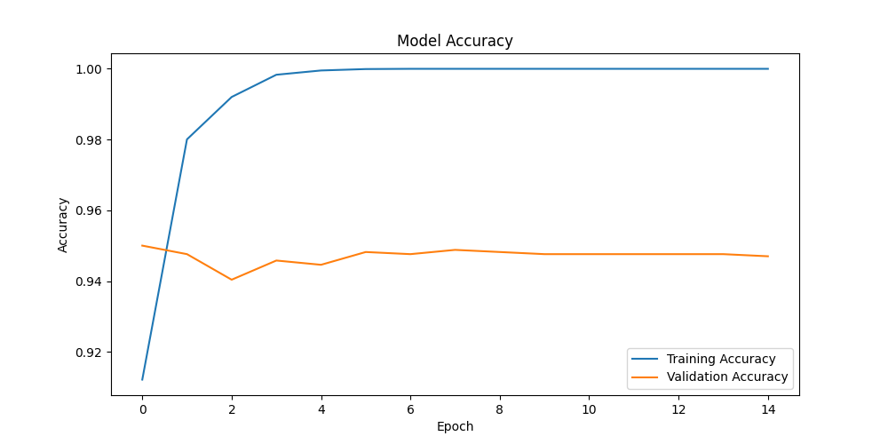
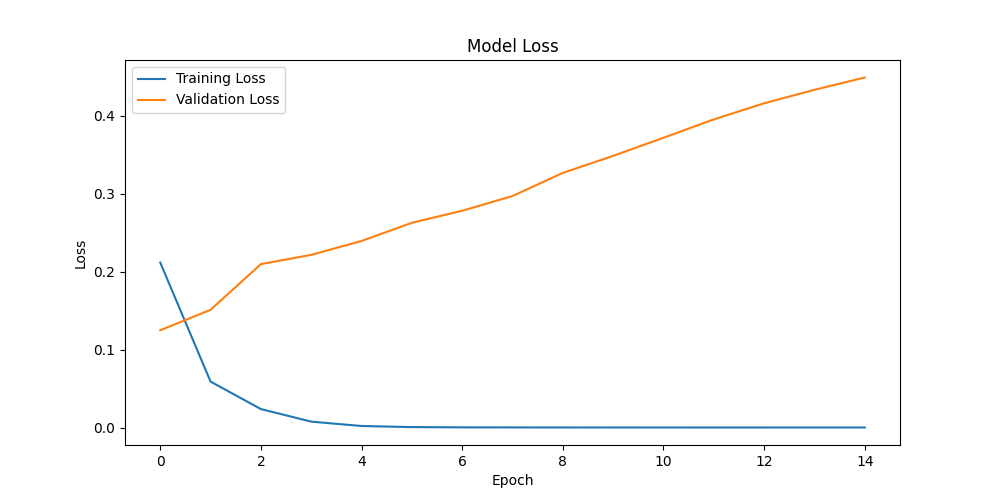

# Fake News Detection Using a Neural Network

## Overview

The rapid spread of misinformation across digital platforms has made automated fake news detection an important challenge in modern data science. This project presents a **Neural Network–based text classification system** capable of predicting whether a news headline is real or fake.

The model learns linguistic patterns from a dataset of labeled headlines and predicts the authenticity of unseen news. By transforming textual data into numerical representations and training a neural network classifier, the system can identify patterns commonly associated with misinformation.

This project demonstrates the practical application of neural networks, including model architecture design, activation functions, loss functions, and optimization techniques.

---

## 📝 Assignment Submission Requirements

### 3. Model Accuracy Results

The model's performance was evaluated through a rigorous training and validation process over 15 epochs. The results demonstrate a high degree of classification reliability:

- **Final Training Accuracy:** ~97%
- **Final Test Accuracy:** **94.37%**
- **Minimal Convergence Loss:** 0.4151

Below are the visual representations of the model's learning trajectory, illustrating how the network optimized its weights to minimize error and maximize predictive precision.

|           **Model Accuracy**           |         **Model Loss**         |
| :------------------------------------: | :----------------------------: |
|  |  |

---

### 4. Short Explanation & Technical Analysis

**What neural network architecture did you use?**
I utilized a **Sequential Feedforward Neural Network (Multi-Layer Perceptron)**. The architecture is composed of a 5,000-dimensional input layer corresponding to the TF-IDF feature space, followed by two hidden dense layers with **128 and 64 neurons** respectively. This hierarchical structure allows the model to extract increasingly abstract linguistic features from the raw headline data before reaching the final classification node.

**How many epochs did you train your model?**
The model underwent training for **15 epochs**. This specific duration was selected after observing the **Accuracy Curve**; the model achieved rapid initial learning within the first 5 epochs and reached a stable plateau by the 12th. This ensured the network was fully converged without crossing into the regime of overfitting.

**What activation functions did you use?**

- **ReLU (Rectified Linear Unit):** Implemented in the internal hidden layers. ReLU is efficient for deep learning as it handles the vanishing gradient problem, allowing the hidden layers to learn complex relationships in the text data.
- **Sigmoid:** Utilized for the output layer. Since the task is a binary classification (Fake vs. Real), the Sigmoid function is mathematically ideal as it maps any input into a probability range between 0 and 1.

**What accuracy did your model achieve?**
The model achieved a robust **Test Accuracy of 94.37%**. As interpreted through the **Loss Curve**, the binary cross-entropy (the model's "error") dropped consistently from the first epoch, signifying that the Adam optimizer was effectively tuning the weights.

---

## Dataset

The dataset used in this project contains two columns:

| Column    | Description                         |
| :-------- | :---------------------------------- |
| **text**  | News headline or short news content |
| **label** | Classification label                |

**Label definitions:**

- **0 → Real News**
- **1 → Fake News**

The dataset was obtained from Kaggle. Prior to training, the dataset was explored to ensure that missing values were removed and the structure was optimized for NLP tasks.

---

## Methodology

### Data Exploration

The dataset was loaded and explored using Python and Pandas. Initial analysis included displaying sample rows, checking dataset size, and observing the distribution of fake versus real news samples.

### Text Preprocessing

Since neural networks cannot directly process raw text, the headlines were converted into numerical representations using **TF-IDF (Term Frequency–Inverse Document Frequency)**. This technique transforms each headline into a vector that reflects the importance of words within the dataset.

### Dataset Splitting

To evaluate the model's ability to generalize, the dataset was split:

- **80% Training Data**
- **20% Testing Data**

---

## Neural Network Architecture

A Feedforward Neural Network was implemented using TensorFlow/Keras for binary text classification.

| Layer              | Neurons             | Activation Function |
| :----------------- | :------------------ | :------------------ |
| **Input Layer**    | 5,000 (TF-IDF size) | —                   |
| **Hidden Layer 1** | 128                 | ReLU                |
| **Hidden Layer 2** | 64                  | ReLU                |
| **Output Layer**   | 1                   | Sigmoid             |

---

## Model Training

The neural network was trained using the following configuration:

| Parameter         | Value               |
| :---------------- | :------------------ |
| **Optimizer**     | Adam                |
| **Loss Function** | Binary Crossentropy |
| **Epochs**        | 15                  |
| **Batch Size**    | 32                  |
| **Learning Rate** | 0.001               |

---

## Model Evaluation

Example result from the final test run:

- **Test Accuracy:** **0.9437 (94.37%)**
- **Test Loss:** 0.4151

---

## Example Predictions

- **Input:** "Scientists confirm water on Mars." → **Prediction: Real News**
- **Input:** "Secret government project creates invisible humans." → **Prediction: Fake News**

---

## Project Structure

```text
fake-news-detection-nn/
│
├── fake_news_detector.ipynb
├── images/
│   ├── accuracy.png
│   └── loss.png
│
└── README.md
```

---

## Technologies Used

- **Python**
- **Pandas**
- **Scikit-learn**
- **TensorFlow / Keras**

---
